<p align="center">
  
  <br/>
  <b>openCrow</b>
  <br/>
  <i>Self-hostable multi-device AI assistant platform.</i>
</p>

- **Server:** Go
- **Web UI:** Next.js
- **Infra:** Docker Compose (PostgreSQL + Redis)


## Features

- **Multi-device** AI gateway
- **Scheduled** and on-demand **task execution**
- **Sandboxed tool execution** with Linux shell
- **Configurable via LLM** and UI with server-side persistence
- **Email integration** with inbox and send capabilities
- Access **remote ssh servers** for command execution
- **Telegram and Signal** integrations for chatting and notifications
- Chat via voice with **Whisper** speech recognition
- LLM provider agnostic with built-in support for OpenAI-compatible, OpenAI, OpenRouter, ...
- Configurable heartbeat agent with custom prompt and scheduling

## Quick start

Use one of the two compose files depending on your mode.

### Development (`compose.dev.yaml`)

```bash
cp .env.example .env

docker compose -f compose.dev.yaml up --build
```

What you get in dev:
- hot-reload for **server** (`CompileDaemon` rebuilds/restarts on `.go` changes)
- hot-reload for **web** (`next dev` with source mounted from host)

Stop dev stack:

```bash
docker compose -f compose.dev.yaml down
```

### Production (`compose.yaml`)

```bash
cp .env.example .env

docker compose -f compose.yaml up --build -d
```

Stop prod stack:

```bash
docker compose -f compose.yaml down
```

### Open

- Web UI: `http://localhost:3000`
- API health: `http://localhost:8080/healthz`

## Current API baseline

- Auth/session/device isolation: `/v1/auth/*`, `/v1/sessions`, `/v1/devices`
  - Includes deployment auth mode introspection: `GET /v1/auth/mode`
- Conversations/messages (user-scoped): `/v1/conversations`, `/v1/conversations/{id}/messages`
- Tasks/schedules (user-scoped): `/v1/tasks`, `/v1/schedules`
- Memory/settings baseline (user-scoped): `/v1/memory`, `/v1/settings`
- Orchestration baseline: `/v1/orchestrator/complete`
  - Completion responses now include provider/tool/runtime trace metadata
- Automation baseline: `/v1/heartbeat*`, `/v1/email/*`
- User config file API (persisted server-side): `GET /v1/config`, `PUT /v1/config`
  - Includes dynamic tool definitions (`id`, `name`, `description`, `parameters`) and enabled map
- Dedicated dynamic tools API: `GET /v1/tools`, `PUT /v1/tools`
  - Enables partial save/load flows for tool definitions without committing full config payload
- Skills API: `GET /v1/skills`, `PUT /v1/skills`
- Guarded server command execution API: `POST /v1/server/command`

## Container networking note

The web service uses an internal API URL (`http://server:8080`) for SSR calls inside Docker,
while browsers read the URL from a `<meta name="x-api-base">` tag injected at request time from the `API_BASE_URL` env var — no rebuild required to change it.

## Config Studio UI

The web app now includes a full configuration studio for:

- Email integrations/accounts (add/edit/remove)
- Tool toggles and custom Golang tool entries
- Dynamic tool definitions loaded from server (name/description/parameters), with ability to add/remove/edit
- Dedicated "Save tools only" flow wired to `/v1/tools`
- LLM skills editor with dedicated save flow wired to `/v1/skills`
- Server command runner panel wired to `/v1/server/command`
- Chat trace panel surfaces provider attempts, tool calls, and runtime actions from orchestrator responses
- Linux sandbox toggle and shell
- LLM providers (OpenAI-compatible, Anthropic, Gemini, GroqCloud, Ollama Cloud,
  OpenAI, OpenCode, OpenRouter, Z.AI, xAI, Mistral, DeepSeek, HuggingFace)
- System and heartbeat prompts
- Memory entries (edit/remove)
- Schedules (edit/remove)
- Heartbeat controls (enable, interval, active hours, model)

All of the above is persisted by the server in a file at `/data/config.json`
inside the server container (`server_state` volume).

## Repository

- `server/` Go API service
- `web/` Next.js UI
- `server/migrations/` SQL migrations
